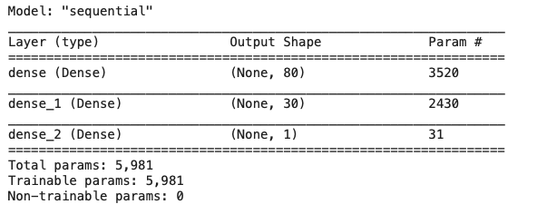
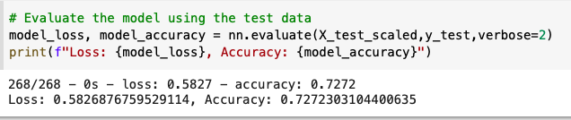
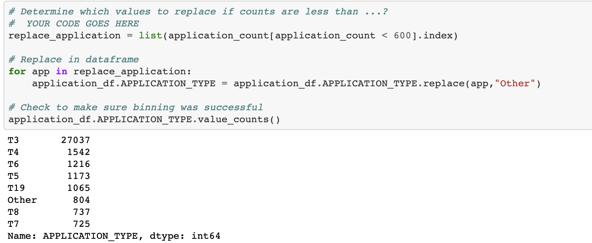
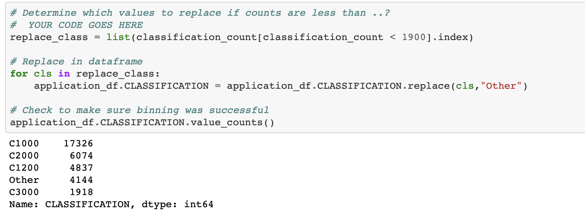
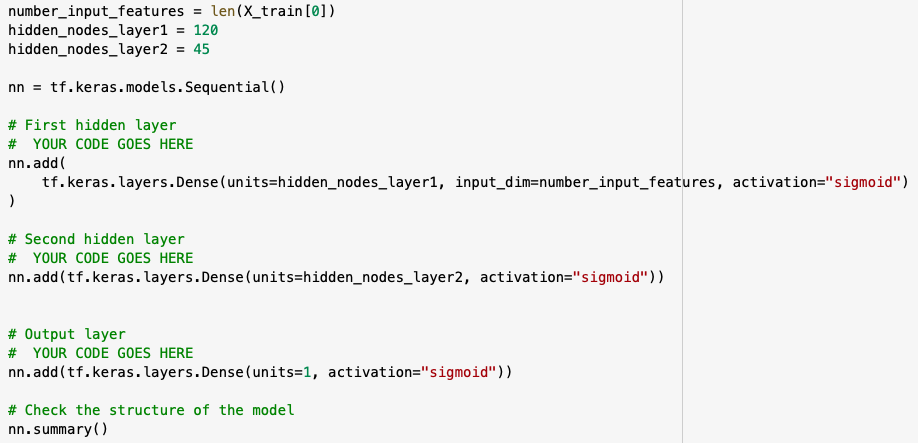
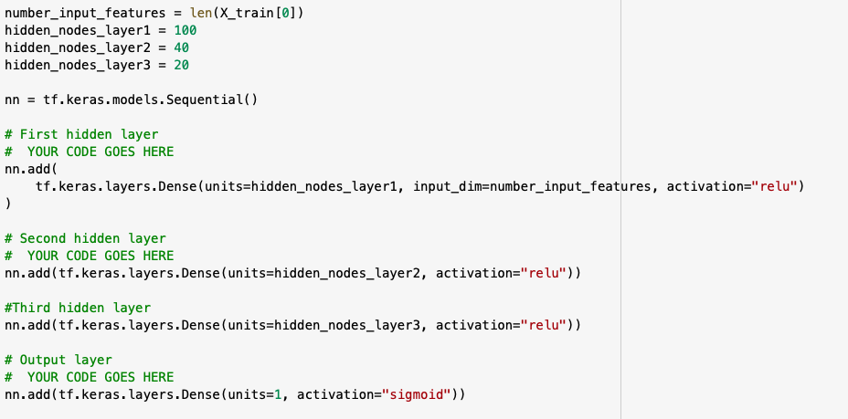

# Neural_Network_Charity_Analysis
## Overview
The purpose of this project is to create a deep-learning neural network to analyze and classify the success of charitable donations.

## Results

### Data Preprocessing
   - The target for this model is the "IS_SUCCESSFUL" column from the dataset, the binary variable that shows if a charitable donation was used effectively or not. 

   - The features for this model are the application type, affiliation, classification, use case, organization, status, income amount, special considerations, and ask amount variables. 
   - The EIN and Name variables are neither targets nor features and therefore were removed from the input data. 

### Compiling, Training, and Evaluating the Model
   - Since we have about 40 inputs in the data, I used 80 neurons in the initial neural network model and 2 hidden layers to start. I used the relu activation function because we have positive nonlinear input data that we are trying to classify. 
  
   - The accuracy score for this model was 72.7% so I was not able to achieve the target model performance of 75%. 
  
   - To increase model performance I tried dropping the "Ask_Amt" column in my first optimization attempt as there were several outliers that could have been skewing the data and I was unable to successfully bin the data. I also adjusted the bin sizes for the application and classification data. This slightly lowered the accuracy score to 72.4%.
  
  
   - In my second optimization attempt I added more neurons to the model and used the sigmoid activation function instead but the accuracy score stayed about the same at a 72.5%.
  
   - In my third and final optimization attempt, I added a third hidden layer to the model but the accuracy score was only at 72.8%.
  
   
## Summary
Summary: Summarize the overall results of the deep learning model. Include a recommendation for how a different model could solve this classification problem, and explain your recommendation.
